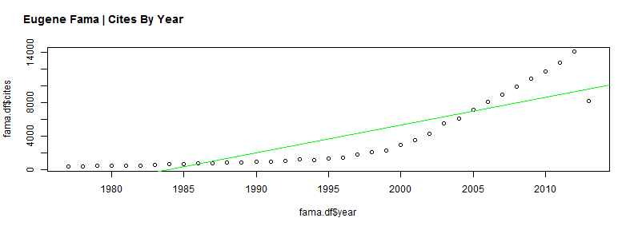

### R package scholar
James Keirstead's new R package [`scholar`](http://www.jameskeirstead.ca/blog/new-r-package-scholar/) offers Google scholar data in a very easy format.  As you can see below the code is very simple.  One little nuisance I found though is that not all researchers (like Ken French) have Google ids, and even if they do, we have to find them [manually](http://scholar.google.com/citations?user=yP7euFUAAAAJ&hl=en).


```r
# Fama from Google Scholar
# http://scholar.google.com/citations?user=yP7euFUAAAAJ&hl=en yP7euFUAAAAJ

# French from Google Scholar does not exist

library(scholar)
famaId = "yP7euFUAAAAJ"
fama.df <- compare_scholar_careers(famaId)
plot(fama.df$cites ~ fama.df$year, type = "p")
abline(lm(fama.df$cites ~ fama.df$year), col = "green")
title(main = "Eugene Fama | Cites By Year", adj = 0.05, outer = TRUE, line = -2)
```

 

---
### Plot with rCharts Using dygraphs
Everything is better when it is interactive.  Let's expose `dygraphs` to `rCharts` for now as a custom implementation.

<div class = 'row'>
  <div id = "dygraphCite" class = 'span8' style = 'height:300px;'>
  </div>
</div>
<br>


```r
library(rCharts)

fama.df$date <- paste0("#! new Date(", as.numeric(as.POSIXct(paste0(fama.df$year, 
    "-12-31"))) * 1000, ")!#")

dy1 <- rCharts$new()
dy1$setLib(".")
dy1$templates$script = "chart.html"
dy1$set(data = fama.df, x = "date", y = "cites", chart = list(title = "Eugene Fama - Career in Citations from Google Scholar", 
    ylabel = "Citations", showRangeSelector = TRUE, labelsDivStyles = list(background = "none"), 
    strokeWidth = 1.5))
cat(noquote(dy1$html(chartId = "dygraphCite")))
```

<script>
  (function(){
    var params = {
 "dom": "dygraphCite",
"width":    800,
"height":    400,
"data": {
 "id": [ "yP7euFUAAAAJ", "yP7euFUAAAAJ", "yP7euFUAAAAJ", "yP7euFUAAAAJ", "yP7euFUAAAAJ", "yP7euFUAAAAJ", "yP7euFUAAAAJ", "yP7euFUAAAAJ", "yP7euFUAAAAJ", "yP7euFUAAAAJ", "yP7euFUAAAAJ", "yP7euFUAAAAJ", "yP7euFUAAAAJ", "yP7euFUAAAAJ", "yP7euFUAAAAJ", "yP7euFUAAAAJ", "yP7euFUAAAAJ", "yP7euFUAAAAJ", "yP7euFUAAAAJ", "yP7euFUAAAAJ", "yP7euFUAAAAJ", "yP7euFUAAAAJ", "yP7euFUAAAAJ", "yP7euFUAAAAJ", "yP7euFUAAAAJ", "yP7euFUAAAAJ", "yP7euFUAAAAJ", "yP7euFUAAAAJ", "yP7euFUAAAAJ", "yP7euFUAAAAJ", "yP7euFUAAAAJ", "yP7euFUAAAAJ", "yP7euFUAAAAJ", "yP7euFUAAAAJ", "yP7euFUAAAAJ", "yP7euFUAAAAJ", "yP7euFUAAAAJ" ],
"year": [ 1977, 1978, 1979, 1980, 1981, 1982, 1983, 1984, 1985, 1986, 1987, 1988, 1989, 1990, 1991, 1992, 1993, 1994, 1995, 1996, 1997, 1998, 1999, 2000, 2001, 2002, 2003, 2004, 2005, 2006, 2007, 2008, 2009, 2010, 2011, 2012, 2013 ],
"cites": [    380,    394,    478,    478,    520,    464,    633,    661,    647,    759,    802,    872,    914,    984,    942,   1055,   1238,   1167,   1336,   1491,   1828,   2096,   2264,   2982,   3558,   4332,   5541,   6118,   7187,   8073,   9001,   9901,  10857,  11743,  12784,  14064,   8157 ],
"career_year": [ 0, 1, 2, 3, 4, 5, 6, 7, 8, 9, 10, 11, 12, 13, 14, 15, 16, 17, 18, 19, 20, 21, 22, 23, 24, 25, 26, 27, 28, 29, 30, 31, 32, 33, 34, 35, 36 ],
"name": [ "Eugene F. Fama", "Eugene F. Fama", "Eugene F. Fama", "Eugene F. Fama", "Eugene F. Fama", "Eugene F. Fama", "Eugene F. Fama", "Eugene F. Fama", "Eugene F. Fama", "Eugene F. Fama", "Eugene F. Fama", "Eugene F. Fama", "Eugene F. Fama", "Eugene F. Fama", "Eugene F. Fama", "Eugene F. Fama", "Eugene F. Fama", "Eugene F. Fama", "Eugene F. Fama", "Eugene F. Fama", "Eugene F. Fama", "Eugene F. Fama", "Eugene F. Fama", "Eugene F. Fama", "Eugene F. Fama", "Eugene F. Fama", "Eugene F. Fama", "Eugene F. Fama", "Eugene F. Fama", "Eugene F. Fama", "Eugene F. Fama", "Eugene F. Fama", "Eugene F. Fama", "Eugene F. Fama", "Eugene F. Fama", "Eugene F. Fama", "Eugene F. Fama" ],
"date": [  new Date(2.52396e+11),  new Date(2.83932e+11),  new Date(3.15468e+11),  new Date(347090400000),  new Date(378626400000),  new Date(410162400000),  new Date(441698400000),  new Date(473320800000),  new Date(504856800000),  new Date(536392800000),  new Date(567928800000),  new Date(599551200000),  new Date(631087200000),  new Date(662623200000),  new Date(694159200000),  new Date(725781600000),  new Date(757317600000),  new Date(788853600000),  new Date(820389600000),  new Date(8.52012e+11),  new Date(8.83548e+11),  new Date(9.15084e+11),  new Date(9.4662e+11),  new Date(978242400000),  new Date(1009778400000),  new Date(1041314400000),  new Date(1072850400000),  new Date(1104472800000),  new Date(1136008800000),  new Date(1167544800000),  new Date(1199080800000),  new Date(1230703200000),  new Date(1262239200000),  new Date(1293775200000),  new Date(1325311200000),  new Date(1356933600000),  new Date(1388469600000) ] 
},
"x": "date",
"y": "cites",
"chart": {
 "title": "Eugene Fama - Career in Citations from Google Scholar",
"ylabel": "Citations",
"showRangeSelector": true,
"labelsDivStyles": {
 "background": "none" 
},
"strokeWidth":    1.5 
},
"id": "dygraphCite" 
};
    var data = _.unzip([params.data[params.x],params.data[params.y]]);
    params.chart.labels = [params.x,params.y];
    new Dygraph(
      document.getElementById( 'dygraphCite' ),
      data,
      params.chart
    );
  })();
</script>


So far I am very impressed with `dygraphs` and look forward to more thoroughly testing it especially with larger data sets.  Take a look at the [gallery](http://dygraphs.com/gallery/) to see its full power, mostly out of the box and accessible even with this basic rCharts implementation.  Also, there is a very lively [Google group of dygraphs-users](https://groups.google.com/forum/#!forum/dygraphs-users).

---
### Thanks
- [Ramnath Vaidyanathan](http://twitter.com/ramnath_vaidya)
- [James Keirstead](http://www.jameskeirstead.ca/)
- Dan, Alistair, Robert, and Klaus - dygraphs contributors
- [Marcello Palmitessa](http://aozora.github.io/bootplus/)
